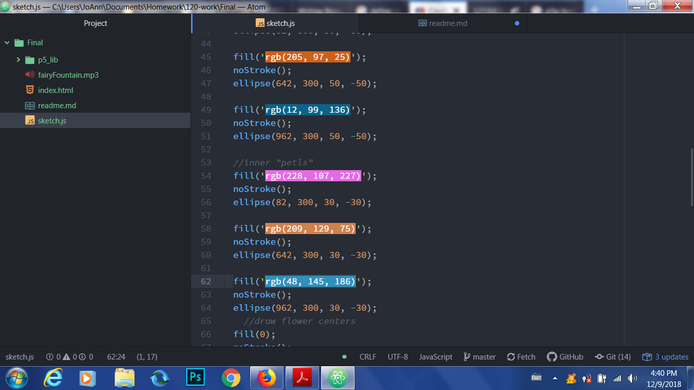

# Final Project
Jacqueline Evans-Shaw, 51

## Project Idea
---
For this project, I had the idea to create a garden setup with a soundtrack. This decision came after being inspired by several of the final projects from last term.

## Work Cycle
---
It took me several tries to set up the canvas and the moving element of the sketch, which was the cloud, but eventually I was able to achieve this with some persistence. Afterwards I completed the following:
- I got assistance in programming in the looping soundtrack;
- I designed the landscape, with grass;
- I designed the subsequent flower stalks;
- I designed the mountains and sun in the distance;
- I designed the conceptual "petals" around all three flowers.

## Issues
---
In this project, I encountered multiple setbacks, first with coding the music. After getting help for this problem, I found I was not properly calling the p5js Library that would allow the music to play. After this was fixed, I needed further assistance with coding my backdrop that represented grass in the sketch, which took several tries (but after a lot of help and hard work, we got it!). Further, I was unable to programming mouse-click interactions into the garden like I had hoped, mostly because I was unfamiliar with how to work the mechanics into the code (also, I had been told it would be acceptable to leave out the interaction). Even so, it would have been interesting to see how interaction would have changed the sketch, but overall I am satisfied with what I was able to produce.

This piece in general was a challenge for me because I'm used to creating simpler, more abstract sketches; but the help I received was pivotal in showing me my strengths and weaknesses when working with code, and I feel more confident and excited to pursue coding-based art, now that I had become more comfortable with it and have seen what I can do with it.

## Successes
---
What I feel most proud of in this sketch is the comprehensiveness of it. In past assignments, I would take elements and assemble them in ways that was perhaps not entirely cohesive, and more abstract than literal, which was sometimes discouraging. However, with this final product I was able to put aside enough time and resources to help me make something that feels complete and aesthetically pleasing. Also using music in my sketch gave it a more in-depth feeling, and I'm proud of myself for seeking help with this element instead of taking it out an settling for less in the final product.

Additionally, even though my final product is not going to be the most outstanding of all those submitted, I'm satisfied knowing that I put in all the time and work I was able to, and this makes my appreciation for the process and the art more significant in this way.

## Further Learning
---
As I previously mentioned, Im interesting in further learning how to effectivly take mouse interactions with code and better apply them to my sketches. I would have loved to code my flowers in a way that shows them grow over time; further, I would have liked to code leaves onto the stems of the flowers, but my limited time and knowledge of the code restricted me from implementing this code.

