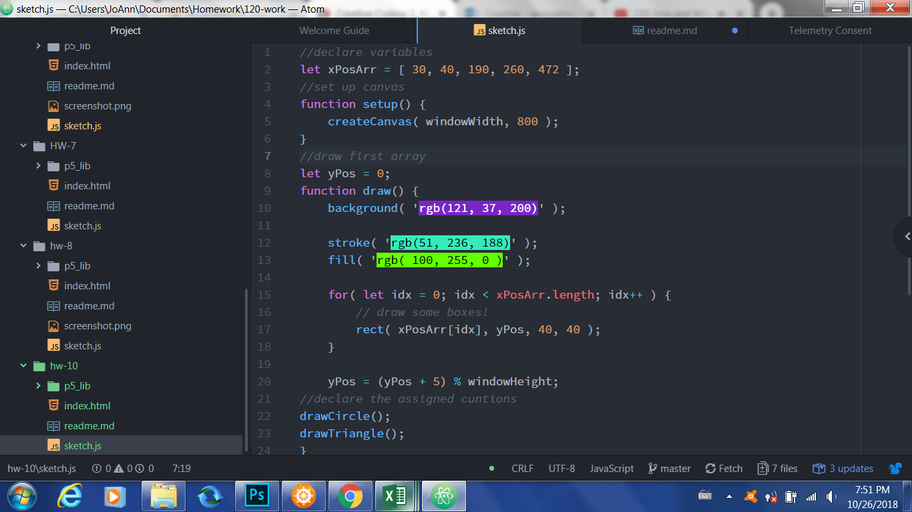

Jacqueline Evans-Shaw, 51
# Week 10 HW README Document
---
## Summary
For this work cycle, I decided to make a simple piece to practice using arrays and functions.

## Steps Taken
---
For this work cycle, I decided to make a simple piece. I executed this work as follows:
- I designed the array first as a moving element across the screen;
- I then designed the circle function to serve as the first stationary element;
- I finally designed the triangle function to serve as the second stationary element.

## Issues
---
I encountered few issues, but one question which I directed to the Issues Forum regarding how to predicate the actions of one function object (such as a circle) on the actions of another (such as a triangle) so as to make them interactive with one another.

## Further Learning
I would be interested in learning what else I can design with the array aspect in coding.

