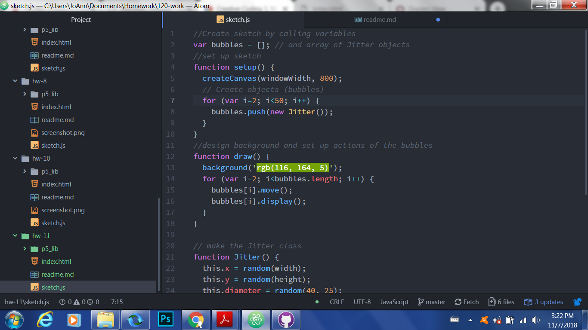

Jacqueline Evans-Shaw, 51
# Week 11 Homework README Document

## Summary
---
For this work cycle, I decided to play more with the concept of jittering bubbles.
## Steps Taken
---
To complete this assignment, I did the following:
- followed the tutorials online;
- set up my canvas;
- designated my bubble variables;
- attributed a class to them and designed their actions.

## Issues
---
This week I did not encounter serious issues; I was satisfied with my work because I felt I better understood this week's assignment.

## Further Learning
---
I am interested in what other objects can be designed for future programming.

