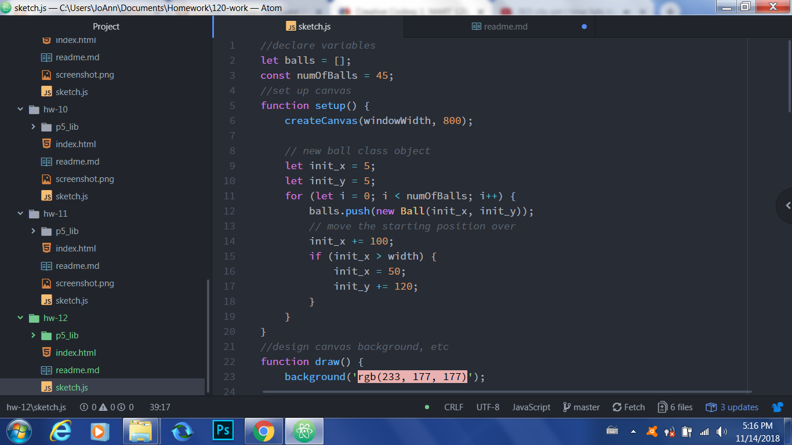

Jacqueline Evans-Shaw, 51

# Week 12 Homework Readme Document

## Work Cycle
---
This week, I decided to code balls interacting with their environment in the homework.

## Steps Taken
---
To achieve the design, I did the following:
- designed the canvas;
- created the Ball class and defined the methods;
- coded in an edgecheck to help the balls identify the boundaries of the sketch;
- coded in a ballcheck to help the balls identify other balls within the given space

## Issues
---
At first I had some issues getting the balls to bounce off of each other; but I was able to do so by following the tutorials more closely, and also got some help from classmates in the forum. I also am not quite sure how to get them to stop sticking to one another.

## Further Learning
---
I am interested in learning if there is any way to integrate a mouseclick function simultaneously with the setup I created in this sketch.

## Help
---
This week I was able to help another classmate brainstorm ideas for a project via the issues forum.

