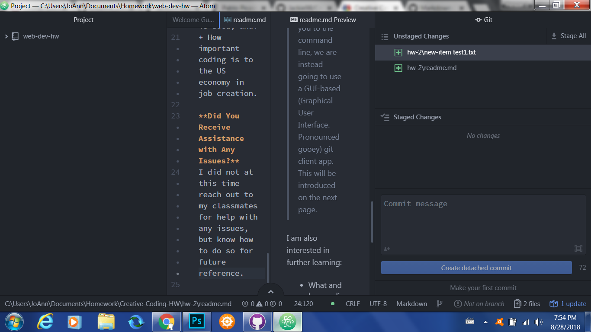

# Jacqueline Evans-Shaw
***
## Weekly Summary
***
**Summarize the work you did this homework cycle**

 I updated my Atom application on my desktop, and installed the recommended themes/packages.
 **What Steps Did You Take to Complete This Assignment?**

 I took the necessary steps of creating a new repository for the class, updating my Github desktop application and reading through the assignment directions and tutorials to complete the assignment. All of these resources I found on the [Creative Coding Website](https://montana-media-arts.github.io/creative-coding-1/modules/week-2/overview/).

**Problems & Issues**
The only problems I personally experienced were due to my outdated Atom application, and my rusty knowledge of Markdown, which I was able to refresh with some extra reading online. I have not yet seen any technical issues posted in the forums, but when I do I will do my best to assist.
**Is Ther Anything in Particular You Leaned?**
I learned on the meaning and pronounciation of "GUI" on the Week 2 GUI Application page of the website:
>Rather than introduce you to the command line, we are instead going to use a GUI-based (Graphical User Interface. Pronounced gooey) git client app. This will be introduced on the next page.

I am also interested in further learning:
+ What and how coding contributes to digital visual art
+ How often this artform is used, and:
+ How important coding is to the US economy in job creation.

**Did You Receive Assistance with Any Issues?**
I did not at this time reach out to my classmates for help with any issues, but know how to do so for future reference.

