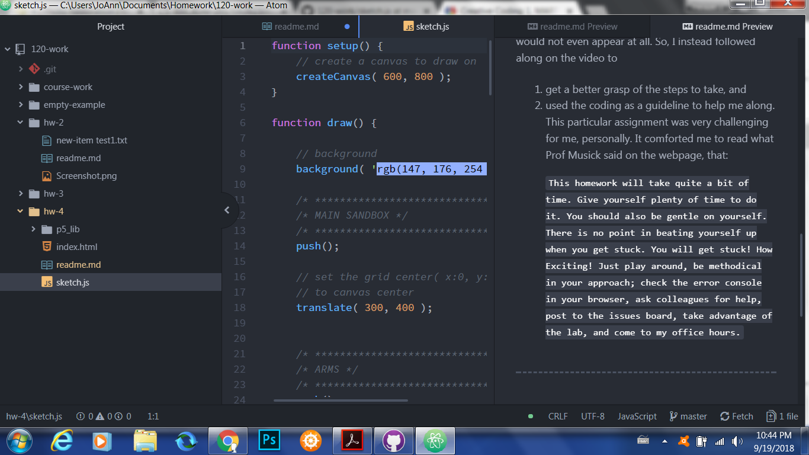

# Jacqueline Evans-Shaw
[Monster Sketch](https://github.com/Jackie98/120-work/blob/master/hw-4/sketch.js)
---
## Week 4
---

  For this week's assignment, we used p5 techniques to create a self portrait or a monster. I chose to follow along with the example video, and built a monster.

---
# Steps Taken
---
  I mainly followed along with the homework demonstration video, because I was a bit lost on where and how to start. I primarily did the following:
    * create a 600 x 800 canvas
    * make the background "blue"
    * utilize the ellipse function for the body, stroke option for arms;
    * utilized triangles for the legs, and the ellipse function for head and hands, as well as the eyes
    * I added color to these parts and positioned them on the grid as I liked
    ---

  # Issues
  ---
  I was actually very frustrated upon making my first attempts on the monster sketch, based on what I had read. Shapes kept disappearing on the canvas, or would not even appear at all. So, I instead followed along on the video to
  1. get a better grasp of the steps to take, and
  2. used the coding as a guideline to help me along. This particular assignment was very challenging for me, personally. It comforted me to read what Prof Musick said on the webpage, that:

  ```This homework will take quite a bit of time. Give yourself plenty of time to do it. You should also be gentle on yourself. There is no point in beating yourself up when you get stuck. You will get stuck! How Exciting! Just play around, be methodical in your approach; check the error console in your browser, ask colleagues for help, post to the issues board, take advantage of the lab, and come to my office hours.
```

  ---
  # Further Learning
  I am interested in further learning about the versatility of quad groups.

  # Etc
   ---
   I wasn't able to help out other classmates this time, as I didn't feel I understood the material enough to do so (but I am working on that).

   ---
   
  ---
