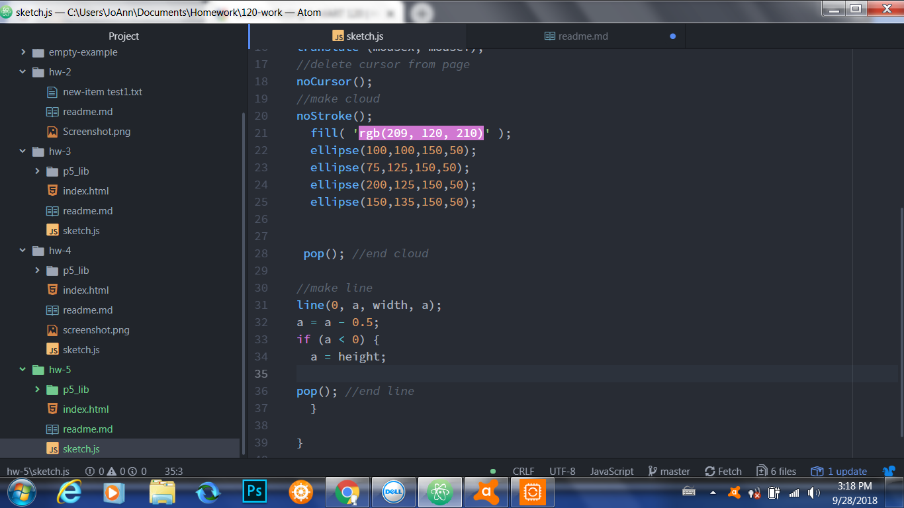

Jacqueline Evans-Shaw, 51
# Week 5 HW README Document
---
## Work Cycle
---
My work cycle this week began with following the tutorials and trying to understand the material.

## Steps Taken
---
To complete this assignment, I did several things:

- I learned how to contruct a moving line on the canvas to count as my independent animation;
- Learned how to construct a raincloud to use as my cursor animation;
- Put these together for the finalized art piece.

## Issues
---
 I experienced issues with my code not manifesting in the browser, but resolved this when I discovered that I was not properly closing my code at the end. I also experienced other issues I intend to post in the forum as well.

## What I Learned
---
I am not entirely satisfied with what I made, as this project was rather challenging for me, so I am intrigued to learn more about coding animation in general.

I did not participate in the forum this week.

