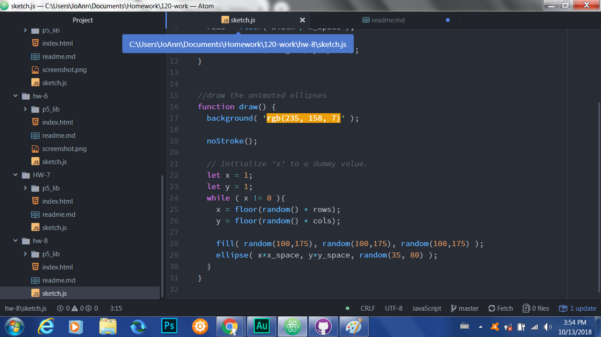

Jacqueline Evans-Shaw, 51
# Week 8 README Document

This week, we focused on rendering _for loops_ and _while loops_.

## Work Cycle
---
For this week, my work process was as follows:
- I created the canvas to fit the height and width of the window;
- I assigned variables;
- I set the x and y spaces;
- I drew the ellipses, filled them, and randomized their movement

## Issues
---
I did not experience any issues with this week's assignment.

## Further Learning
---
I would be interested in further learning how to apply loops in other coding ventures.

## Help Forums
---
I have yet to look into how I can help other students this week.

